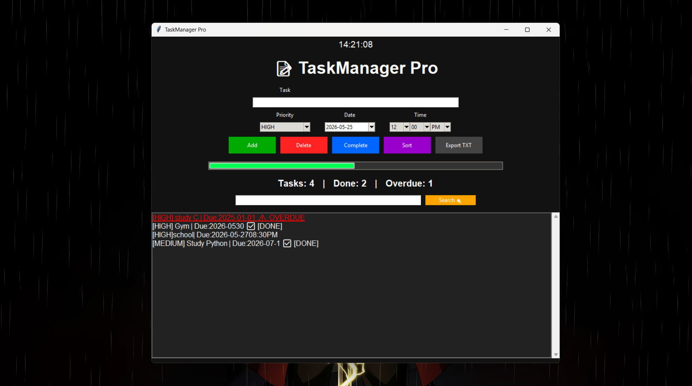

# 📝 TaskManager Pro

Modern Python task manager with GUI built using Tkinter.

## 🚀 Features

✅ Add tasks  
✅ Delete tasks  
✅ Complete tasks  
✅ Priority system (HIGH / MEDIUM / LOW)  
✅ Deadline + Time (AM/PM)  
✅ Overdue alerts ⚠  
✅ Search tasks 🔍  
✅ Sort by priority  
✅ Progress bar 📊  
✅ Export tasks TXT  
✅ Statistics (Done / Overdue / Total)  
✅ JSON save system  

---

## 📸 Screenshot



---

## ⚙ Installation

Install requirements:

```bash
pip install tkcalendar